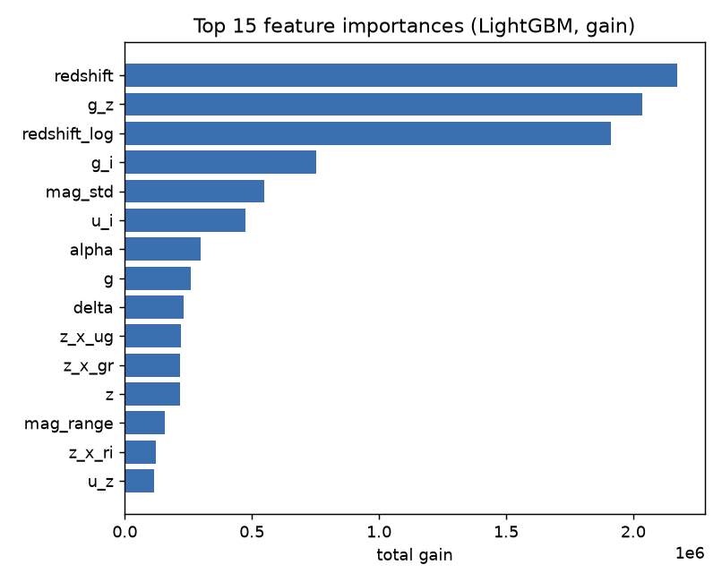
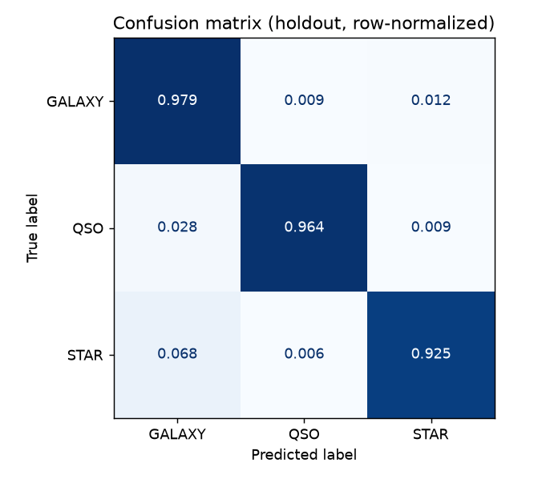

# Predicting Stellar Class — Kaggle Playground S6E6

Classifying astronomical objects as **GALAXY / QSO / STAR** from photometric and
spectroscopic measurements — with an emphasis on **honest evaluation** over
leaderboard-chasing.

> **Headline:** a color-index feature-engineering + gradient-boosting pipeline that
> scores **0.957 on the private leaderboard** — and, more importantly, a
> **[documented investigation](docs/diagnostics.md)** into why its cross-validation
> score (0.968) systematically overstated the real test set by ~0.011. Catching and
> explaining that gap is the part of this project I'm most proud of.

---

## The problem

[Playground Series S6E6](https://www.kaggle.com/competitions/playground-series-s6e6)
is a 3-class classification task on ~577k labelled training rows and ~247k test
rows, scored on **accuracy**:

| Class | Meaning |
|-------|---------|
| `GALAXY` | A galaxy |
| `QSO` | A quasar (quasi-stellar object) |
| `STAR` | A star |

## Approach

**1. Physics-motivated feature engineering.** The five photometric bands
`u, g, r, i, z` are brightnesses through different filters. In astronomy the
*difference* between two bands (an object's "color") separates these object types
far better than raw brightness, so the pipeline builds adjacent and wide color
indices, per-row magnitude summaries, and redshift interactions — 27 features in
total. The gain-based importances confirm the thesis: the engineered color indices
and redshift transforms are the top predictors.

**2. Gradient boosting with honest cross-validation.** LightGBM trained with
`StratifiedKFold` (5 folds) and early stopping, producing out-of-fold predictions
for an unbiased score. A LightGBM + XGBoost + CatBoost weighted blend was also built
and evaluated (see results — it did *not* help).

| Feature importance (gain) | Confusion matrix (holdout) |
|---|---|
|  |  |

*Redshift and engineered colors dominate; `STAR` is the hardest class, most often
confused with `GALAXY`.*

## Results

| Model | CV (5-fold) | Public LB | Private LB |
|-------|:-----------:|:---------:|:---------:|
| **LightGBM baseline** | 0.96805 | **0.95657** | **0.95736** |
| LightGBM + XGBoost blend | 0.96809 | 0.95644 | 0.95717 |

The **simpler baseline wins** on the real leaderboard. The blend's +0.00004 CV edge
was noise — the leaderboard ranked the two models the other way.

## The interesting part: my CV was lying → [`docs/diagnostics.md`](docs/diagnostics.md)

Cross-validation promised **0.968**; the leaderboard delivered **0.956** — a gap
~10× larger than sampling noise could explain. Rather than accept it, I ran a
hypothesis-elimination investigation and **falsified seven explanations** with
evidence (including adversarial validation, a leak-free out-of-fold recomputation,
and prediction-agreement analysis — and including my *own* leading theory). The
surviving explanation is **concept drift**: identical feature distributions but a
subtly different label rule between train and test.

The takeaways drove real changes in method: treat CV as a *relative* compass only,
ignore CV moves below the noise floor, and never trust complexity you can't verify.
**Full write-up: [docs/diagnostics.md](docs/diagnostics.md).**

## Repository layout

```
kaggle-stellar-class/
├── src/
│   ├── stellar.py     # LightGBM 5-fold baseline → submission.csv
│   ├── ensemble.py    # LGB + XGB + CatBoost, OOF blend + weight search
│   └── figures.py     # regenerates the README figures from the data
├── docs/
│   └── diagnostics.md # the CV-vs-leaderboard investigation (start here)
├── assets/            # generated figures
├── LEARNING.md        # from-scratch explainer of the pipeline + GBM internals
├── requirements.txt
└── data/              # train.csv / test.csv — gitignored, add your own
```

## Reproduce

```bash
python -m venv venv
# Activate — Windows PowerShell: venv\Scripts\Activate.ps1 | macOS/Linux: source venv/bin/activate
pip install -r requirements.txt
```

Get the data (not committed — Kaggle redistribution rules), then run:

```bash
# place train.csv / test.csv in data/, or:
kaggle competitions download -c playground-series-s6e6 -p data/ && unzip data/*.zip -d data/

python src/stellar.py     # baseline → submission.csv  (the leaderboard submission)
python src/ensemble.py     # 3-model blend + weight search → submission_ensemble.csv
python src/figures.py      # regenerate assets/ figures
```

## What this project demonstrates

- **Feature engineering** grounded in domain knowledge, validated by importances.
- **Rigorous validation** — StratifiedKFold, out-of-fold scoring, ensembling.
- **Model diagnostics** — adversarial validation, leak-free CV, concept-drift
  detection, error analysis.
- **Scientific debugging** — falsifiable hypotheses tested one at a time, including
  discarding my own when the evidence killed it.
- **Honest evaluation & communication** — reporting the real 0.956, not the
  flattering 0.968, and explaining exactly why they differ.

## Further reading

- **[docs/diagnostics.md](docs/diagnostics.md)** — the CV-vs-leaderboard investigation.
- **[LEARNING.md](LEARNING.md)** — a from-scratch walkthrough of the pipeline and the
  gradient-boosting internals (how a tree's leaf values are learned and how
  predictions are computed), written to be understandable without an ML background.
